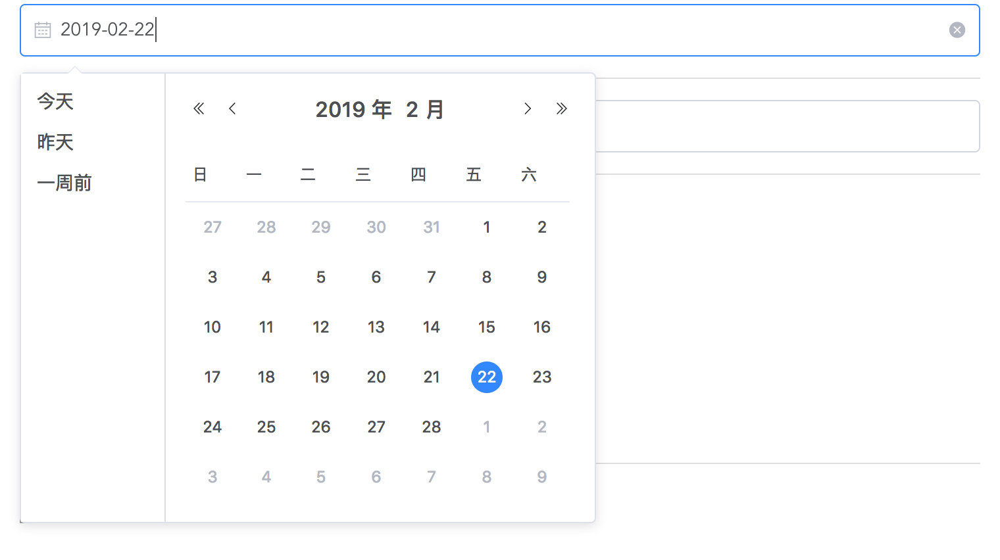
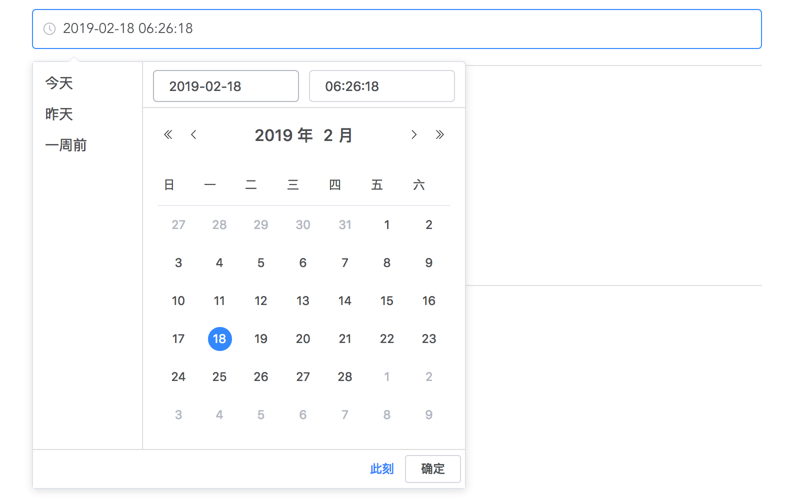

## hd-vue-form

> 基于 Vue.js 生成常用HTML表单元素。

项目地址：https://www.npmjs.com/package/houdunren-vue-form

## 安装

### 前台配置
使用 npm 安装 `vue-form`

```
npm i houdunren-vue-form
```

**完整引入**

在 main.js 中写入以下内容：

```
import Vue from 'vue';

//配置elementui
import ElementUI from 'element-ui';
import 'element-ui/lib/theme-chalk/index.css';
Vue.use(ElementUI);

//配置vue-form
import HdVueForm from 'HdVueForm';
//参数url为后台处理地址
Vue.use(HdVueForm,{url:'http://hdcms-laravel.hd/vue-form-upload'});

import App from './App.vue';

new Vue({
  el: '#app',
  render: h => h(App)
});
```

### CSRF

针对 Laravel 等后端框架，需要在 head 标签设置CSRF

```
<meta name="csrf-token" content="{{ csrf_token() }}">
```

## 组件

### 基础知识

#### 属性说明

组件属性由基本属性如 `title、value、error、name` 和 扩展属性 `options` 构成。

> 使用频率高的属性我们定义为了基本属性，其他属性使用扩展属性创建

扩展属性中可以使用任何表单属性，并使用options设置

```
<hd-input :options="{class:'isbox',style:'color:green'}" value="后盾人" name="title" error="错误信息"/>
```

#### 错误信息

基本属性 `error` 用于显示错误信息内容，当设置了`error`属性时表单将描红并显示错误信息。

### 组件列表

#### 文本框

```
<hd-input name="title" title="标题" value="内容" error="错误信息"/>
```

#### 文本域

```
<hd-textarea name="content" title="标题" rows="2">houdunren.com</hd-textarea>
```

#### 单张图片

```
<hd-image name="avatar" image-url="http://www.houdunwang.com/attachment/2018/05/29/90651527574866.jpg"></hd-image>
```

| 属性       | 说明                             |
| ---------- | -------------------------------- |
| name       | 表单name                         |
| image-url  | 默认显示图片                     |
| allow-szie | 允许在传大小单位MB，可以设置小数 |
| url        | 后台处理地址                     |


**后台返回值**

```
#上传成功返回结果
return ['file' => '文件地址', 'code' => 0];

#上传失败返回结果，系统会自动弹出错误信息
return ['message' => '错误内容', 'code' => 403];
```

#### 日期选择

```
<hd-datepicker name="date" value="2019-2-22"></hd-datepicker>
```



#### 日期时间

```
<hd-datetimepicker name="datetimepicker" value="2019-2-18 06:26:18"></hd-datetimepicker>
```



### 编辑器

```
<hd-simditor name="content" url="/upload-simditor"></hd-simditor>
```
* name——表单name用于POST提交
* url——文件上传地址，默认址为 /upload-simditor

**后台返回值**

```
return [
	"success"   => true,
	"msg"       => "上传成功",
	"file_path" => "1.jpg"//文件地址
];
```